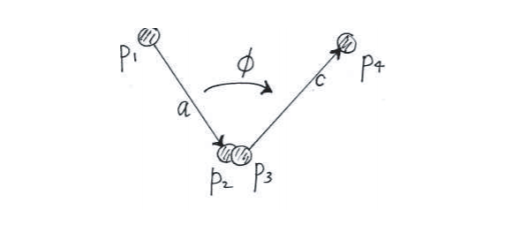
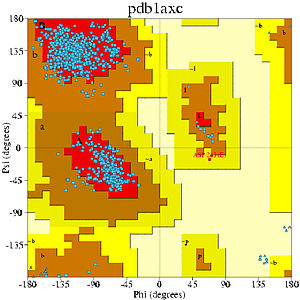
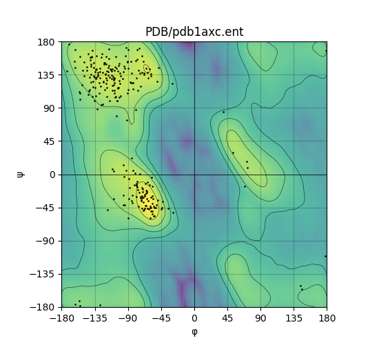

# Ramachandran-Map-plotter
-------------
This is a program to plot the Ramachandran Map of DNA sequences and calculate the Backbone Torsion Angles of the DNA. 
On running the program, it reads the PDB ids from the question6.txt file and checks whether the required DNA sequence is already present in the PDB folder. If not it downloads the sequence. It then plots the Ramachandran Map and stores the .png files in `RMAP-Projects`. It also calculates the backbone torsion angles and the ingnored residues of the DNA sequence.
The torsion angle is given by
\begin{equation}\phi=\tau(a,b,c)\end{equation}
where $\phi$ is the torsion angle and \begin{equation}a, b,c\end{equation} are the vectors between four atoms in the molecule.

  

### Requirements
* Python 3.8 or above
* numpy
* Biopython
* RamachanDraw
* matplotlib

## Example
---
### Plotting the Ramachandran Map of 1AXC
**Example from wikipedia -**
 

  

**Example from program -**
 

  

http://chart.apis.google.com/chart?cht=tx&chl=
